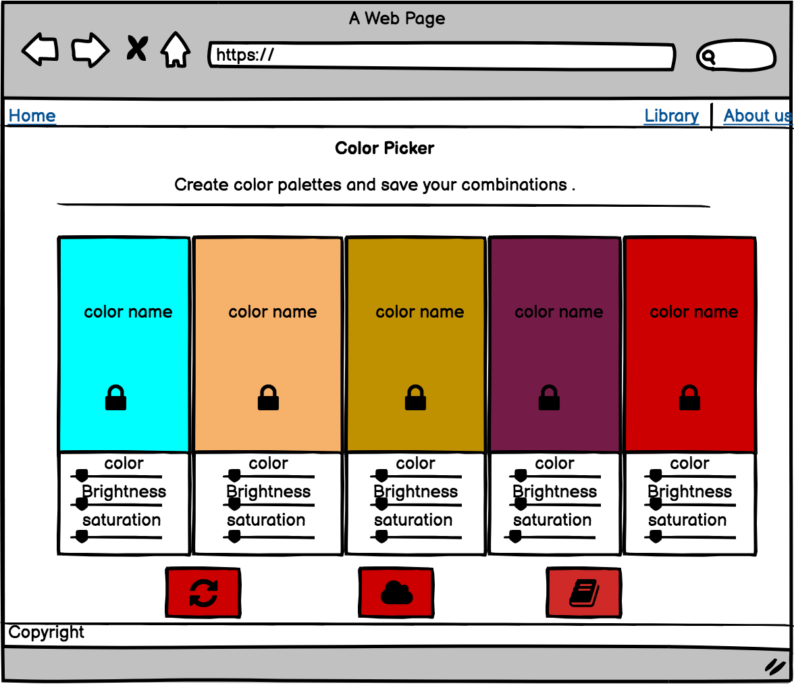

# Interactive Frontend Development Milestone Project

## Color Picker
---

[View the live project here.]( ) 

This is the second milestone project for Code Institute. Color Picker is a color pallete generator website, which can be saved to a library.

### wireframe

## Features
---

#### Existing Features

- The site contains one homepage where a random pallete color is generated.
-  Different colors are created by clicking in the button Refresh under the block of colors.
- The name of the hex color is shown in the middle of the color div.
- A button of a lock icon in the middle of the div allow the user to keep that color and stop it pushing other when click to refresh. The same button can be opened to continue pushing colors when click refresh button.
- Possibility of saving the pallete to a library, with a chosen name to it by clicking in the button save.
- A library button, when clicked shows alls the saved palletes.

#### Features Left to Implement

- Add the aditional div with with 3 range button and javscript functionality for chosing the color, the brightness and saturation, according to the original wireframe design.
- Have a user page with login and the palletes created saved to the database for this specific user.
- Have one page showing examples of palletes created by users.
- instead of ganerate random colors, have a color igual similar to adobe color.

## Technologies Used

---

### Languages Used

- [HTML5](https://en.wikipedia.org/wiki/HTML5)
- [CSS3](https://en.wikipedia.org/wiki/CSS)  
- [Javascript]( https://pt.wikipedia.org/wiki/JavaScript)

### Frameworks, Libraries & Programs Used

- [Chroma.js](https://gka.github.io/chroma.js/#installation)
     - Generate and manipulate colors.

- [Bootstrap CDN](https://www.bootstrapcdn.com/)
    - Bootstrap CDN was used through adding ccol classes and modals.

- [GoogleFonts](https://fonts.google.com/)   
    - 

- [Font Awsome](https://fontawesome.com/)  
    - To include icons.

- [Git](https://git-scm.com/) 
    - Git was used for version control by committing and pushing the code to GitHub.
- [GitHub](https://github.com/)   
    -  GitHub is being used to store the project.

## Testing
---

The website was manually tested for responsiveness.

### Validator Testing

HTML  - To implemet
- [W3C Markup Validator](https://validator.w3.org/nu/) 
No errors were returned when passing through the official W3C validator

CSS - to implement
No errors were found when passing through the official (Jigsaw) validator
- [W3C CSS Validator  ](https://jigsaw.w3.org/css-validator/#validate_by_input) 

Javascript - To implement

    jshint 

### Unfixed Bugs
You will need to mention unfixed bugs and why they were not fixed. This section should include shortcomings of the frameworks or technologies used. Although time can be a big variable to consider, paucity of time and difficulty understanding implementation is not a valid reason to leave bugs unfixed.

## Deployment
---

1. Log in to GitHub and locate the [GitHub Repository](site in here)
2. At the top of the Repository (not top of page), locate the "Settings" Button on the menu
3. Scroll down the Settings page until you locate the "GitHub Pages" Section.
4. Under "Source", click the dropdown called "None" and select "Master Branch".
5. The page will automatically refresh.
6. Scroll back down through the page to locate the now published site [link](site in here ))  in the "GitHub Pages" section.

#### Making a Local Clone

1. Log in to GitHub and locate the [GitHub Repository](site in here).
2. Under the repository name, by the left side of the green Gitpod button click in Code.
3. To clone the repository using HTTPS, under "Clone with HTTPS", copy the link.
4. Open Git Bash
5. Change the current working directory to the location where you want the cloned directory to be made.
6. Type git clone, and then paste the URL you copied in Step 3.
7. Press Enter. Your local clone will be created.

## Credits
---

#### Content

- Inspirations
    - https://color.adobe.com/create
    - https://codepen.io/ckuijjer/pen/vEQdxp

- The Code to push the colors was made with classes from Chrma.js documentation.

- Aditional help to save to storage
    - https://www.codegrepper.com/code-examples/javascript/json+local+storage
    - https://www.w3schools.com/js/tryit.asp?filename=tryjson_store

- The text for the Deployment section was copied from the [CodeInstituteSampleRead.me](https://github.com/Code-Institute-Solutions/SampleREADME). 

#### Acknowledgements

