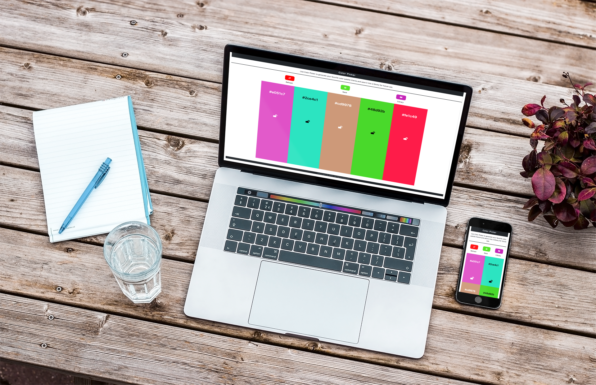

# Interactive Frontend Development Milestone Project

## Color Picker
---

[View the live project here.](https://adrianaschmit.github.io/Color_picker/) 

This is the second milestone project for Code Institute. Color Picker is a color pallete generator website, which can be saved to a library.

## Features
---

### Existing Features

- Homepage
    - The site contains one homepage where a random pallete color is generated.

- Refresh button
    - when on click it generate the different random colors on the divs.

- Save buuton
    - By clicking on it, it saves the pallete to a library, with a chosen name.

- Library Button  
    - When clicked shows alls the saved palletes, with the possible to choose one of them to show on the background.

- The name of the hex color is shown in the middle of the color div with constrat to the background color.

- A button of a lock icon in the middle of the div allow the user to keep that color and stop it pushing other when click to refresh. The same button can be opened to continue pushing colors when click refresh button.

#### Features Left to Implement

- Add the aditional div with with 3 range button and javscript functionality for chosing the color, the brightness and saturation, according to the original wireframe design.
- Have a user page with login and the palletes created saved to the database for this specific user.
- Have one page showing examples of palletes created by users.
- instead of ganerate random colors, have a color igual similar to adobe color.
- implement a vast amount of comment explaining in the details the code with js.doc
- Fix the bugs found.

### wireframe

## Technologies Used

---

### Languages Used

- [HTML5](https://en.wikipedia.org/wiki/HTML5)
- [CSS3](https://en.wikipedia.org/wiki/CSS)  
- [Javascript]( https://pt.wikipedia.org/wiki/JavaScript)

### Frameworks, Libraries & Programs Used

- [Chroma.js](https://gka.github.io/chroma.js/#installation)
     - Generate and manipulate colors.

- [Bootstrap CDN](https://www.bootstrapcdn.com/)
    - Bootstrap CDN was used through adding ccol classes and modals.

- [GoogleFonts](https://fonts.google.com/)   
    - 

- [Font Awsome](https://fontawesome.com/)  
    - To include icons.

- [Git](https://git-scm.com/) 
    - Git was used for version control by committing and pushing the code to GitHub.
- [GitHub](https://github.com/)   
    -  GitHub is being used to store the project.

## Testing
---

Manual tests were performed.
 - On click to refreseh button it correctly push new colors to the divs backgroung.
 - The proper hex name of color show in the div.
 - The lock button on the div, on click, close the color correctly to not change by clickinh on refresing.
 - Hex name and lock button have colors contrasting to the background color for a better user experience.
 - Button save correctly saves the pallete with the chosen name to the library.
 - The library button correctly opens with all the palletes saved with their respective names.
 - Inside the library , clicking on select pallete, it correctly closes and show on the background the pallete chosen.
 - the hex name is updated correctly according to the color, when chosing a new pallete from the library.
 - the website is responsive.

### Validator Testing

HTML  
- [W3C Markup Validator](https://validator.w3.org/nu/) 
Error reported on unfixed bugs.

CSS - to implement
No errors were found when passing through the official (Jigsaw) validator
- [W3C CSS Validator  ](https://jigsaw.w3.org/css-validator/#validate_by_input) 

Javascript 
- [Jshint](https://jshint.com/) 
Error reported on unfixed bugs.

### Unfixed Bugs

- User can save without giving a name to pallete or using the save name. Not fixed for being short on time.

- From W3C Markup Validator
The element button must not appear as a descendant of the a element. Not fixed for being short of time.

- From jshint
    - 'arrow function syntax (=>)' is only available in ES6 (use 'esversion: 6').
    One of the ways to try to fix that was using  jshint esversion: 6 as described in the lick below with no sucess. Erroir message was , 	The 'esversion' option cannot be set after any executable code. https://stackoverflow.com/questions/42866159/arrow-function-syntax-is-only-available-in-es6-use-esversion-6

## Deployment
---

1. Log in to GitHub and locate the [GitHub Repository](https://github.com/AdrianaSchmit/Color_picker)
2. At the top of the Repository (not top of page), locate the "Settings" Button on the menu
3. Scroll down the Settings page until you locate the "GitHub Pages" Section.
4. Under "Source", click the dropdown called "None" and select "Master Branch".
5. The page will automatically refresh.
6. Scroll back down through the page to locate the now published site [link](https://adrianaschmit.github.io/Color_picker/ )  in the "GitHub Pages" section.

#### Making a Local Clone

1. Log in to GitHub and locate the [GitHub Repository](https://github.com/AdrianaSchmit/Color_picker).
2. Under the repository name, by the left side of the green Gitpod button click in Code.
3. To clone the repository using HTTPS, under "Clone with HTTPS", copy the link.
4. Open Git Bash
5. Change the current working directory to the location where you want the cloned directory to be made.
6. Type git clone, and then paste the URL you copied in Step 3.
7. Press Enter. Your local clone will be created.

## Credits
---

#### Content

- Inspirations
    - https://color.adobe.com/create
    - https://codepen.io/ckuijjer/pen/vEQdxp

- The Code to push the colors was made with classes from Chrma.js documentation.

- Aditional help to save to storage between others that were not able to be listed here.
    - https://www.codegrepper.com/code-examples/javascript/json+local+storage
    - https://www.w3schools.com/js/tryit.asp?filename=tryjson_store

- The text for the Deployment section was copied from the [CodeInstituteSampleRead.me](https://github.com/Code-Institute-Solutions/SampleREADME). 

#### Acknowledgements
---
Thanks to tutors, my mentor and student care team for the support.

